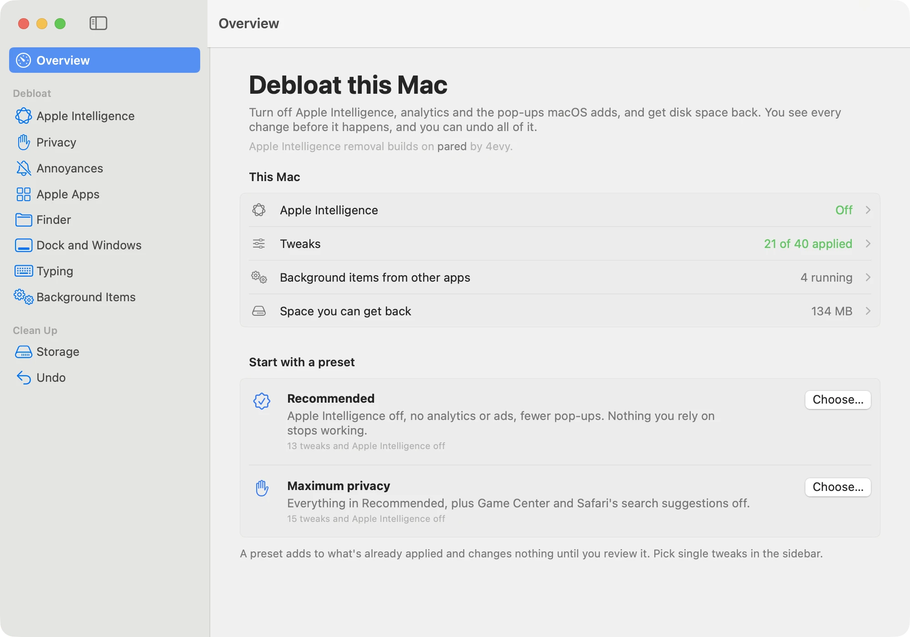
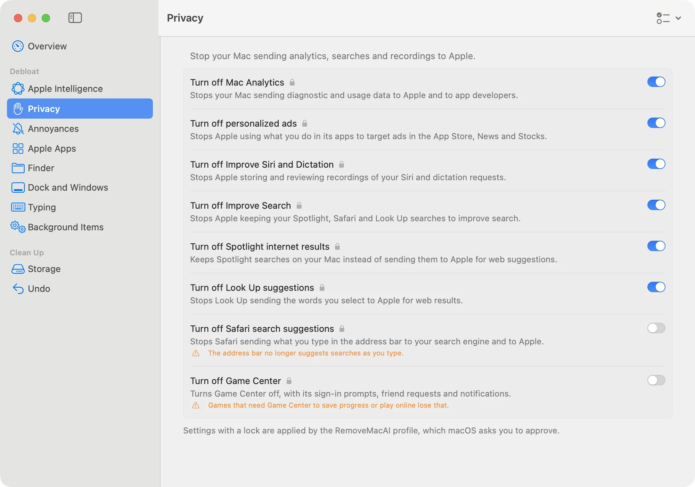

<p align="center">
  <picture>
    <source media="(prefers-color-scheme: dark)" srcset="docs/screens/overview-dark.webp">
    
  </picture>
</p>

# RemoveMacAI [CN 优化适配版]

[](README.md)
[](https://github.com/DonJone/RemoveMacAI/releases)
[](LICENSE)
[](https://apple.com)
[](https://apple.com)

为 macOS 瘦身净化：彻底关闭 Apple Intelligence 并彻底清理本地端侧大模型文件，禁用系统分析与诊断上报，拦截个性化广告，精简系统弹窗干扰，管理第三方应用后台自启服务，并深度回收磁盘存储空间。所有变更在生效前均可完整预览，且随时支持一键无损还原。

[**简体中文文档**](README.md) | [**English Documentation**](README_EN.md)

本项目的 Apple Intelligence 移除核心逻辑基于 4evy 开发的 [pared](https://github.com/4evy/pared) 构建，率先映射了 Apple 统一资产框架服务、模型集合以及相关系统偏好设置键值。本分支针对中文环境进行了全方位的系统级深度适配与动态双语支持。

---

## 安装与快速启动

### 方式一：安装图形界面 App

打开“终端”（应用程序 > 实用工具 > 终端），粘贴以下命令并回车：

```sh
curl -fsSL https://raw.githubusercontent.com/DonJone/RemoveMacAI/main/install.sh | bash -s app
```

该脚本将自动从最新发布版本下载应用、验证 SHA-256 校验和、安装至 `/Applications/RemoveMacAI.app` 并自动启动。

> **手动下载安装**：亦可前往 [Releases 页面](https://github.com/DonJone/RemoveMacAI/releases/latest) 直接下载 `RemoveMacAI.zip`，解压后拖入“应用程序”文件夹。由于本应用未进行 Apple 公证，首次打开时系统可能会提示无法验证开发者，请前往“系统设置 > 隐私与安全性”，下滑至安全性区域点击“仍要打开”即可。

### 方式二：终端命令行工具 (CLI)

```sh
curl -fsSL https://raw.githubusercontent.com/DonJone/RemoveMacAI/main/install.sh | bash
```

此方式将在临时目录中直接运行交互式命令行，不残留多余文件。

> 图形界面 App 与 CLI 命令行工具属于同一套原生程序架构，并共享相同的还原历史记录。

---

## 主要功能与特性

<p align="center">
  <picture>
    <source media="(prefers-color-scheme: dark)" srcset="docs/screens/privacy-dark.webp">
    
  </picture>
</p>

| 分类分组 | 可优化与清理的系统功能 |
|---|---|
| **Apple Intelligence** | 彻底关闭 Siri、写作工具、Genmoji 原创表情、图像乐园、ChatGPT 集成、邮件/信息/Safari/备忘录摘要与通知摘要、内联输入预测、空间照片、照片消除 (Clean Up)、Xcode 代码预测。删除所有本地端侧模型，并阻止 macOS 重新下载。支持单独保留指定所需功能。 |
| **隐私保护** | 关闭 Mac 分析与诊断数据共享、关闭个性化广告、关闭“改进 Siri 与听写”、关闭“改进搜索”、关闭聚焦 (Spotlight) 互联网联机搜索结果、关闭“查询”联机建议、关闭 Safari 搜索建议、关闭 Game Center。 |
| **系统干扰与弹窗** | 禁止点击墙纸隐藏所有窗口显示桌面、隐藏桌面小组件、禁止键盘播放键默认唤起“音乐”App、关闭 iPhone 镜像。 |
| **系统内置应用** | 在音乐 App 中关闭 Apple Music 订阅推广、图书 App 中隐藏“书店”、从程序坞中移除不常用的系统预装应用。 |
| **访达 (Finder) 设置** | 始终显示文件扩展名、显示隐藏文件、显示路径栏与状态栏、按名称排序时文件夹置顶、默认搜索当前文件夹、跳过更改扩展名时的警告、禁止在网络共享宗卷上生成 `.DS_Store`、30 天后自动清倒废纸篓、默认保存到本地磁盘而非 iCloud、显示个人资源库目录 (`~/Library`)。 |
| **程序坞与窗口** | 隐藏程序坞最近使用应用、消除程序坞自动隐藏的响应延迟、禁用程序坞图标启动弹跳、窗口最小化至应用图标、关闭窗口缩放动画、消除平铺并排窗口间的缝隙、截取窗口截图时移除外圈阴影。 |
| **键盘与键入** | 关闭拼写自动更正、关闭智能引号与破折号替换、关闭双击空格输入句号、关闭句首字母自动大写、长按按键连续连打而非弹出重音菜单。 |
| **后台启动项** | 扫描由其他第三方应用安装的更新程序与后台代理（如 Google Updater 等），展示其可执行程序路径并支持按项一键禁用。 |
| **存储空间清理** | 扫描旧版 macOS 安装包、航拍动态屏幕保护视频、iOS 固件更新包、Xcode 衍生缓存与模拟器废弃文件、第三方应用缓存、时间机器本地快照以及可卸载的原生大型套件（GarageBand 乐库、iMovie、Keynote 等），一键安全移至废纸篓。 |

项目内置两套精选预设方案助您快速开始：
- **推荐优化 (Recommended)**：关闭 Apple Intelligence、系统分析上报与广告，消除常见的系统级弹窗干扰，保留您日常依赖的基础功能。
- **最大隐私 (Maximum privacy)**：在推荐优化的基础上，进一步禁用 Game Center 和 Safari 搜索联机建议。

所有预设方案均为叠加生效，且在您手动审核确认前**绝不会擅自修改任何系统设置**。

<p align="center">
  <picture>
    <source media="(prefers-color-scheme: dark)" srcset="docs/screens/review-dark.webp">
    
  </picture>
</p>

---

## 命令行常用手册 (CLI)

| 命令 | 说明 |
|---|---|
| `removemacai` | 检查 Apple Intelligence 当前状态并引导关闭（需交互确认） |
| `removemacai status` | 查看各项 AI 功能状态及本地模型的实际磁盘占用 |
| `removemacai off --keep <特性名>` | 关闭 Apple Intelligence，但保留指定的特性（支持逗号分隔） |
| `removemacai on` | 重新开启 Apple Intelligence，保留其他系统优化项 |
| `removemacai tweaks` | 列出所有 35 项可优化项目及其实时生效状态（支持 `--json`） |
| `removemacai apply <名称...>` | 按名称应用指定的优化项 |
| `removemacai apply --preset recommended` | 应用预设方案（包含彻底关闭 Apple Intelligence） |
| `removemacai undo <名称...>` | 撤销指定的优化项并还原先前值 |
| `removemacai background` | 列出第三方应用的后台启动项；使用 `off` 或 `on` 快速启停 |
| `removemacai clean` | 检查可释放的存储空间；指定项名称可将其安全移至废纸篓 |
| `removemacai export <配置文件.mobileconfig>` | 导出用于 MDM 批量部署的标准配置描述文件 |
| `removemacai revert` | 完全还原 RemoveMacAI 之前做出的所有更改 |
| `removemacai app` | 直接启动图形界面应用程序 |

> **提示**：
> - `apply`、`undo`、`background` 和 `clean` 在执行前均会展示拟修改项并请求确认。
> - 添加 `--dry-run` 参数可仅进行演练预览；添加 `--yes` 可跳过确认提示直接执行。
> - 支持通过环境变量 `REMOVEMACAI_LANG=zh` 或 `REMOVEMACAI_LANG=en` 显式强制指定语言。

<p align="center">
  
</p>

---

## 企业与系统管理员 (MDM 批量部署)

通过 `removemacai export` 可导出标准配置文件，支持通过 Jamf、Kandji、Intune 等 MDM 解决方案在受管设备上集中分发：

```sh
# 导出包含推荐优化策略的描述文件
removemacai export RemoveMacAI.mobileconfig --preset recommended

# 导出关闭 AI 但保留写作工具的描述文件
removemacai export AI-off.mobileconfig --keep writing-tools

# 导出仅包含隐私保护项且不修改 AI 的描述文件
removemacai export Privacy.mobileconfig --no-ai analytics personalized-ads spotlight-web
```

该配置文件包含 Apple Intelligence 的限制载荷、模型下载拦截机制以及受保护的系统级调优项。每台 Mac 还可通过 `removemacai tweaks --json` 输出机器可读的合规检查报告。

---

## 工作原理与安全性

- **受保护的系统设置**：Apple Intelligence 及带有锁形图标的优化项，均通过一个本地配置描述文件生效。macOS 要求用户在“系统设置”中批准此描述文件；若要还原，仅需在“系统设置”中删除该描述文件即可完全恢复。
- **用户级设置与还原保障**：通过类似 `defaults write` 的原生机制读写。在修改前，RemoveMacAI 会将每一项配置的原始旧值保存在 `~/Library/Application Support/RemoveMacAI/journal.json` 中，执行撤销时会无损恢复精确的原值。
- **大模型彻底清理与拦截**：通过 Apple 的统一资产框架服务请求安全移除，并将系统模型下载通道重定向至封闭的本地回路端口，防止 macOS 在后台静默重新拉取数十 GB 模型。
- **空间清理机制**：所有扫描清理项均移至系统“废纸篓”，在您手动清倒废纸篓前绝不永久粉碎，随时可以放回原处。
- **零安全破坏与零数据收集**：全程保持 macOS 系统完整性保护 (SIP) 处于开启状态，严禁修改任何 `/System` 密封系统目录。RemoveMacAI 不会发起任何联网遥测请求，不收集任何用户隐私数据。

---

## 常见问题 (FAQ)

**听写功能还会继续工作吗？**
会。语音听写是 macOS 的独立系统设置，其专属的语音识别模型不会被移除。

**macOS 系统更新后设置会被重置吗？**
配置描述文件会在系统更新后继续保持生效。如果某项用户级偏好设置被系统更新重置，RemoveMacAI 会将其识别为“未应用”，您可以随时一键重新应用。

**模型删除后，“系统设置”里的 Apple Intelligence 为什么还显示有空间占用？**
Apple 资产服务在收到移除指令后会立即释放引用，但 macOS 会根据自身的系统计划异步执行物理磁盘块清理。在此期间，“系统设置 > 通用 > 储存空间”可能会存在短暂的统计滞后。

**为什么后台仍然有一个名为 Siri 的进程在运行？**
在 macOS 27 中，聚焦搜索 (Spotlight) 窗口实际上是由名为 `Siri` 的底层系统进程所驱动的。部分核心系统级守护进程受 SIP 保护，保持运行并不会消耗 AI 模型资源。

**关闭 Apple Intelligence 会影响哪些系统功能？**
上述对应功能（Siri、写作工具、Genmoji、邮件摘要等）、依赖 Apple 端侧大模型框架的第三方应用、以及日历中的自然语言快速解析将被关闭。通用系统操作与正常软件使用完全不受影响。

---

## 系统要求

- **处理器架构**：Apple Silicon (M1 / M2 / M3 / M4 系列芯片，arm64)。
- **操作系统版本**：macOS 27 及以上版本（在 macOS 27.0 与 27.0.1+ 均已深度测试兼容）。

---

## 卸载与清理

如需彻底卸载 RemoveMacAI 并恢复所有原始设置：
1. 在终端运行 `removemacai revert` 或在 App 界面中点击“全部撤销还原”。
2. 删除 `/Applications/RemoveMacAI.app` 及可执行文件，或通过包管理器运行 `brew uninstall removemacai`。

---

## 致谢与声明

- 本项目的 Apple Intelligence 架构建立在 4evy 优秀的开源工具 [pared](https://github.com/4evy/pared) 之上，率先完成了 Apple 资产服务接口、大模型集合以及关键配置键值的逆向映射。相关第三方授权详见 [THIRD-PARTY-NOTICES.md](THIRD-PARTY-NOTICES.md)。
- 原项目作者为 [Om Lahore](https://github.com/omlahore)（[原项目主页](https://github.com/omlahore/RemoveMacAI)）。
- 本分支由 [DonJone](https://github.com/DonJone/RemoveMacAI) 维护，专注于中文本土化适配、环境自适应与构建兼容性优化。

---

## 开源许可证

本项目基于 [MIT License](LICENSE) 协议开源。
